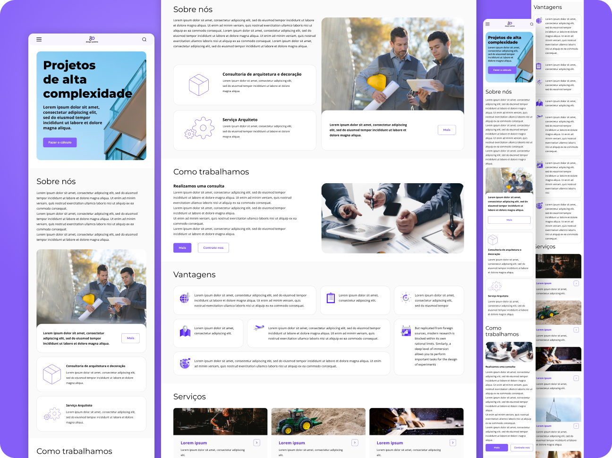

# 💻 Projeto Final Website Responsivo Design Systems ⚙️

Este é o projeto final do Curso de Desenvolvimento de Layout em Front-end da Mentorama: Design Systems, trata-se de um site criado para uma imobiliária, otimizado para as versões Mobile, Tablet e Desktop.

 

## 👨🏾‍💻 Desafio do Projeto
 
Enfrentei uma jornada de desafios ao criar este projeto. A responsividade do site com Media Queries exigiu esforço em cada etapa. Porém, foi ao mergulhar no complexo mundo do CSS Grid, aplicando diferentes templates para cada versão, que me vi diante de um verdadeiro quebra-cabeça, desafiando minha criatividade e expertise.

 

Cada obstáculo superado representou não apenas uma vitória, mas também um marco em minha jornada de crescimento e aprendizado. Mesmo que a proposta inicial fosse desenvolver apenas duas versões, optei por ir além e criar uma terceira versão para desktop, como uma forma de aprimorar ainda mais minhas habilidades e colocar à prova meu comprometimento.

 

## 📸 Screenshots

 

## 🚀 Tecnologias Utilizadas

- HTML5
- CSS3

 

## 🏆 Aprendizado 

- Mobile First
- Responsividade
- Metodologia BEM
- Flexbox
- CSS Grid
- Media Query
- Variáveis CSS

 

## 🧠 Próximos Passos
- Incluir no site animações com CSS e interações com JavaScript. 
- Finalizar o Curso de JavaScript Mentorama.

 

## 🔗 Projeto Hospedado no Vercel
Este projeto está disponível para visualização online através do Vercel.  
Você pode acessá-lo através do link: https://design-systems-iota.vercel.app/

